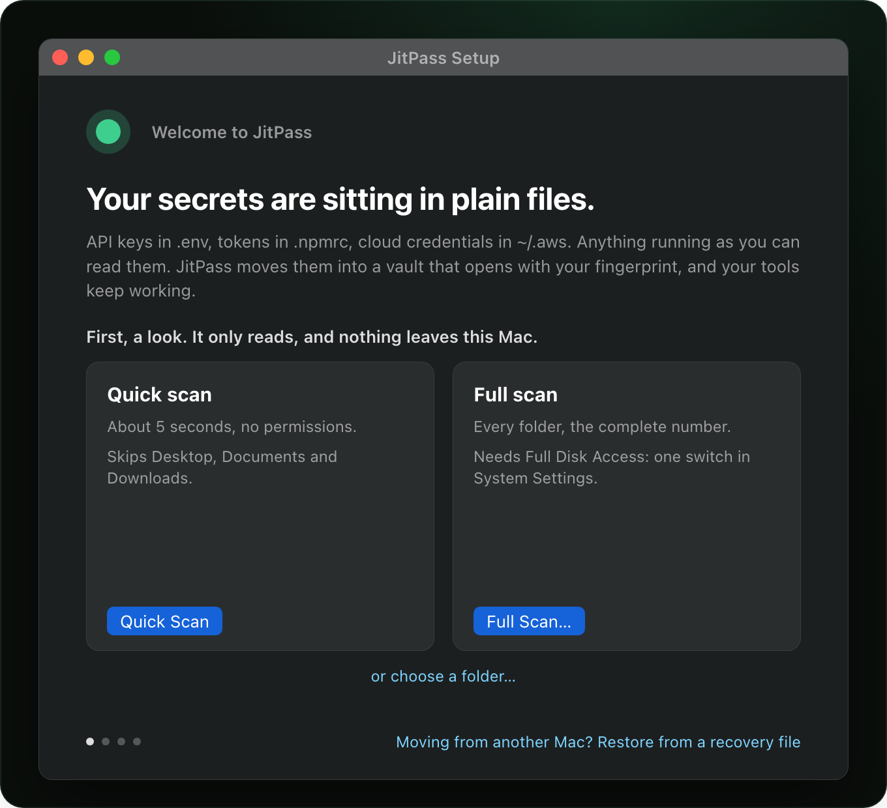

<p align="center">
  <picture>
    <source media="(prefers-color-scheme: dark)" srcset="docs/assets/readme/jitpass-mark-on-dark.svg">
    
  </picture>
</p>

<h1 align="center">JitPass</h1>

<p align="center"><b>Just-In-Time Secret Protection for Developers &amp; AI Agents</b></p>

<p align="center">
  Your AI agent can read every secret on your Mac. JitPass makes it ask first.
</p>

<p align="center">
  <a href="https://github.com/jitpass/jit-app/releases/latest"></a>
  
  
  <a href="./LICENSE"></a>
</p>

<p align="center">
  <a href="https://dl.jitpass.com/jitpass/jit-app/releases/latest/download/JitPass-arm64.zip"><b>Download for Mac</b></a> ·
  <a href="#install"><code>brew install jitpass/tap/jitpass</code></a> ·
  <a href="./docs/index.md">Docs</a> ·
  <a href="https://jitpass.com">jitpass.com</a>
</p>

<p align="center">
  
</p>

Your API keys sit in plain files: `.env`, `~/.aws/credentials`, `.npmrc`,
`~/.zshrc`, your shell history, the MCP configs your agents read. Nothing has
to be hacked for them to leak. Anything running as you can open those files:
a compromised npm package, a trojanized IDE extension, a prompt-injected agent
with your shell.

**JitPass moves each secret into a local vault that opens with Touch ID, and
leaves a decoy where the plaintext was.** Your tools keep working. When a
program reaches for a real value, JitPass names it (which program, launched by
what) and you decide. Everything else gets the decoy, and the read is logged.

## Get protected in three steps

| 1. See what's exposed | 2. Lock it away | 3. Decide who gets one |
| :---: | :---: | :---: |
|  |  |  |
| One scan that only reads. Nothing is changed, and nothing leaves this Mac. | Secrets move to the vault, decoys stay in the files, every file is backed up first. | One fingerprint unlocks the session. Every program that asks is named. |

Open JitPass once and setup walks you through the first two in about two
minutes, no terminal needed; the third is how it works from then on. It lives in the menu bar after that: a green ring means
unlocked, red means locked, amber means something is asking.

<details>
<summary><b>In the terminal instead</b></summary>

```sh
jit scan                 # read-only: every exposed secret, file and line
jit migrate --dry-run    # preview the whole fix plan
jit migrate              # apply it: shows the plan, asks [y/N], one Touch ID
jit run -- npm run dev   # or inject secrets into one process, no file at all
```

`jit scan` with no path sweeps your home folder; point it somewhere to go
faster (`jit scan ~/.aws`). Everything the app does is one of these commands.

</details>

## Install

```sh
brew install jitpass/tap/jitpass
```

That installs JitPass into /Applications with the `jit` command line inside
it, linked onto PATH with shell completions. **Without Homebrew,**
[download the app](https://dl.jitpass.com/jitpass/jit-app/releases/latest/download/JitPass-arm64.zip),
drag it into Applications and open it: it offers to link `jit` onto your PATH
and checks for a newer release once a day.

Either way you get the same signed build, notarized by Apple, and Gatekeeper
checks it before it first runs. To verify that yourself, run `jit doctor`: its
`jit` line reports `signed CZC6BH93GJ`, the same check `jit upgrade` runs
before it installs anything. Upgrade with `brew upgrade jitpass`, or let the
app tell you. Your vault is never touched by an install or an upgrade.

<details>
<summary>Only the command line, for a Mac with no app (the weaker path, and why)</summary>

```sh
curl -sL https://dl.jitpass.com/jitpass/jit/releases/latest/download/jitpass_darwin_arm64.tar.gz | tar -xz jit
shasum -a 256 jit   # compare against checksums.txt on the release page
codesign -dv --verify --verbose=2 ./jit   # expect: Developer ID, TeamIdentifier=CZC6BH93GJ
sudo mv jit /usr/local/bin/
echo 'source <(jit completion zsh)' >> ~/.zshrc && exec zsh
```

`curl` sets no quarantine bit, so Gatekeeper never consults the notarization
ticket; the same is true of `go install`. The binary is still signed and
notarized, so the lines above let you check both, but you have to run them.
Update it with `jit upgrade`, a verified self-update. Pick one route: if you
switch to Homebrew later, remove this copy (`sudo rm /usr/local/bin/jit`),
and `jit doctor` flags two jits on PATH if you forget.

On an Intel Mac, build from source with
`go install github.com/jitpass/jit/cmd/jit@latest`.

</details>

## Built for AI agents

The agent in your editor runs as you, with your permissions, and reads files
for you all day. That is the point of it, and it is why a plaintext `.env` is a
different risk than it was two years ago.

| The same secret, asked for by VS Code | ...and by `claude` |
| :---: | :---: |
|  |  |

- **Every request is named.** The first time a program reaches for a real
  credential, you see which one, launched by what. An agent quietly reading
  `~/.aws/credentials` is a question, not a silent success.
- **Decoys for a cold read.** An agent that greps your repo for `.env` gets
  placeholder values, and the read is logged.
- **MCP configs hold vault paths, not keys.** `jit migrate ~/.claude.json`
  moves the keys out; each server then launches through `jit run`, so the
  config is safe to have on disk and safe to hand to the agent.
- **The AI CLIs themselves:** `jit wrap claude` (and codex, gemini,
  cursor-agent, copilot, cline, opencode, kiro-cli) keeps their own keys in
  the vault too. The app's **AI Agents** window shows all of this at a glance.

```sh
jit migrate ~/.claude.json            # MCP server keys move to the vault
jit wrap claude                       # the agent's own API key too
jit grant --process claude --profile myapp --for 8h   # let it work overnight
jit audit --parent claude             # read back what it touched
```

More in [MCP and AI tools](./docs/migrate/mcp.md) and
[per-process consent](./docs/service/consent.md).

## Your tools keep working

Protect a credential once, then use the tool the way you always have.

```sh
aws s3 ls          # AWS and Terraform: resolved from the vault, no prefix, no flag
gh pr list         # CLIs with their own token (gh, stripe, glab): wrapped once
docker login ghcr.io                  # registry logins go through a credential helper
jit run -- docker compose up          # tools that only read a file get it for one run
./deploy.sh        # exports that lived in ~/.zshrc: new shells just have them
```

The rule behind it: if a tool can ask for a secret itself (AWS
`credential_process`, docker and git credential helpers, kubectl exec plugins,
your shell at login), you type nothing extra. If it only reads a file, `jit run`
hands it the value, or the file becomes a live mount that serves real values
only inside a run you approved.

**Supported:** `.env` files, shell exports, AWS and Terraform, kubeconfig,
Docker registries, GCP ADC, `.npmrc` and `.netrc`, MCP configs, bare token
files, tokens in your shell history, wrappable CLIs (`gh`, `stripe`, `vercel`,
...) and SSO CLIs that mint credentials at login. The full list, with exactly
what to type for each, is **[Supported tools](./docs/tools.md)**; anything else
can be wrapped with [`jit wrap add`](./docs/wrap/custom-tools.md).

**Already use 1Password?** Keep it as your source of truth.
[`jit migrate` links instead of copying](./docs/vault/1password.md): a value
that lives in 1Password is vaulted as its `op://` reference, and JitPass
decides which process gets it.

## Two Touch ID moments

1. **Unlocking the vault.** One fingerprint opens it for the session: 5
   minutes of activity, then it locks again, and never longer than 8 hours.
2. **Handing a credential to a tool.** The first time a given tool reaches
   for a real credential, JitPass asks and names it. The same tool is not
   asked again this session; a different one is.

That second gate is what keeps an unlocked vault from being a free-for-all:
after you have used `aws` yourself, a sketchy `npm install` reaching for the
same keys still gets its own question. Turn it off in Settings, or with
`jit service consent off`, if you only want the vault lock. Starting something
that needs several credentials at once? `jit run --trust -- terraform apply`
approves that whole run in one gesture. Details:
[per-process consent](./docs/service/consent.md).

## Leaving the keyboard

An agent working overnight or a long build stalls on a prompt nobody will see.
A **grant** moves your decision earlier instead of removing it: one Touch ID,
while you are still there, naming exactly what you allow and for how long.

```console
$ jit grant --process claude --profile myapp --for 8h
  Touch ID  ->  let claude under iTerm2 use 2 secrets (myapp) unattended for 8h
✓ granted g-7f3a2c81   claude -> myapp   until 17:42
```

It covers `claude` under the terminal you typed that in, through screen lock,
and nothing named `claude` anywhere else. It ends at its deadline, when you
quit that terminal, or on `jit grant revoke`, which needs no fingerprint:
taking access away is always free. **New Grant…** in the app does the same.
Details: [process grants](./docs/service/grants.md).

## See what happened, and who did it

Every command, unlock and refusal lands in a durable log. Arguments are masked,
so the log proves a command ran without storing the secret it carried.

```console
$ jit audit --since 1h
time=2026-07-24 10:16:22 level=info kind=use op="read a secret" cmd="aws s3 ls" parent=claude secrets=aws/default
time=2026-07-24 10:31:09 level=warn kind=unlock status=denied method=touchid-or-passcode cmd="node postinstall.js" parent=npm secrets=aws/default
```

The first line is the story JitPass exists to tell: `aws/default` read by
`aws s3 ls`, launched by `claude`. The second is a prompt you declined: a
`node postinstall.js` under `npm` reaching for the same keys, refused. Filter
with `--parent claude`, `--secret aws`, `--status denied`, `--since 3d`;
stream with `--follow`; or open **Audit** from the menu bar.

## Nothing is lost, everything undoes

JitPass never destroys a credential. It **moves** the value into the vault and
leaves a **working hook** where it was (a decoy `.env`, an
`eval "$(jit export)"` line in your shell config, `credential_process = jit …`
in `~/.aws/config`, or a `PATH` shim). Before it touches a file, it backs the
file up, encrypted, into the vault.

```sh
jit migrate ~/code/myapp        # applied, one Touch ID
jit migrate undo ~/code/myapp   # every touched file restored, byte for byte
```

## How it works, mechanically

No kernel extension, no filesystem driver, no FUSE. Three mechanisms, picked by
what the tool can do:

1. **Environment variables into one process, then `execve`.** jit's own image
   is replaced by your command, so the value lives in that one process and jit
   is gone from memory.
2. **The tool's native credential protocol**, where one exists: AWS
   `credential_process`, docker and git credential helpers, kubectl exec
   plugins, Terraform's credentials helper. The tool asks, jit answers, no
   file involved.
3. **A named-pipe mount**, for tools that can only read a file.

The mount is a POSIX FIFO, created with `mkfifo(2)` at mode `0600`. A program
calling `open(".env")` blocks in the kernel until a writer connects. The
background service is that writer: it opens the path `O_WRONLY`, which
releases the reader, writes the decrypted bytes from memory into the kernel
pipe buffer, closes, and loops back to `open(2)` for the next reader. Nothing
touches the disk. What gets written is decided per read: decoys for an ambient
reader, real values only inside a run you authorized.

**Caller identity explains and audits, it never decides.** Process names are
forgeable, and a fast-closing FIFO reader can evade identification entirely.
The human answering the prompt is the gate; the process name only tells you
what to answer. The app is a thin client of the same service: every action is
a request the `jit` CLI can also send, and the app never sees a secret value or
a key. Full detail in **[how it works](./docs/getting-started/how-it-works.md)**
and **[live mounts](./docs/run/mounts.md)**.

## What it does not do

It does not make an already-compromised account safe, and it does not protect a
secret once it is in the memory of the process you gave it to. It runs on
macOS 14+ on Apple Silicon only. The boundaries are stated on one page:
**[the deliberate limits](./docs/security/brief.md#deliberate-limits-stated-plainly)**.

## Learn more

- **[Quickstart](./docs/getting-started/quickstart.md)**: setup, migrating, living with the fix
- **[How it works](./docs/getting-started/how-it-works.md)**: the vault, the service, mounts and shims on one page
- **[FAQ](./docs/faq.md)**: developer and security questions, answered bluntly
- **[Supported tools](./docs/tools.md)**: what to type for every tool
- **[Command reference](./docs/reference/commands/jit.md)**: every command and flag, generated from the CLI
- **[Security architecture](./docs/security/architecture.md)**: the threat model and the honest limits
- **[The app](https://github.com/jitpass/jit-app)**: the menu bar app's source
- **[CONTRIBUTING.md](./CONTRIBUTING.md)**: build and test setup; sign-off via DCO (`git commit -s`), which also accepts the [CLA](./CLA.md)

## License

[PolyForm Perimeter License 1.0.0](./LICENSE): free for personal and internal
company use.
