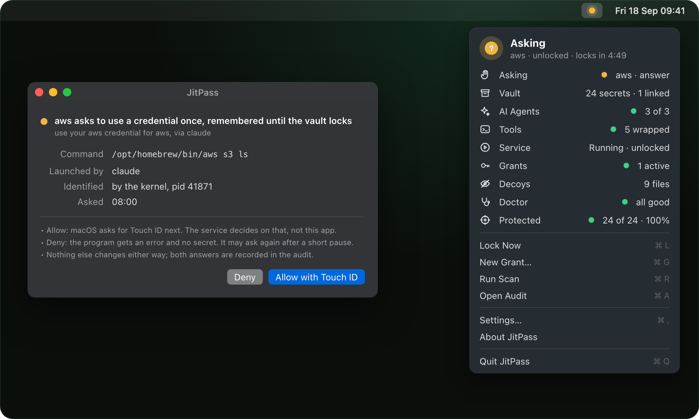
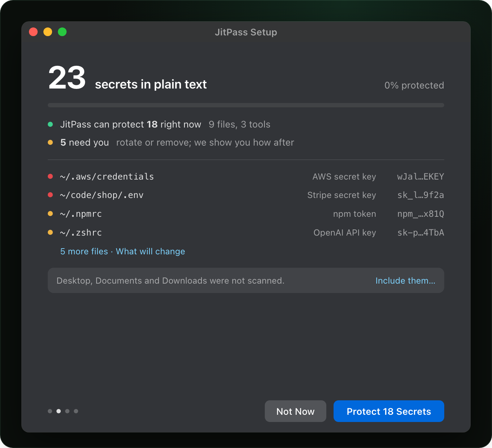
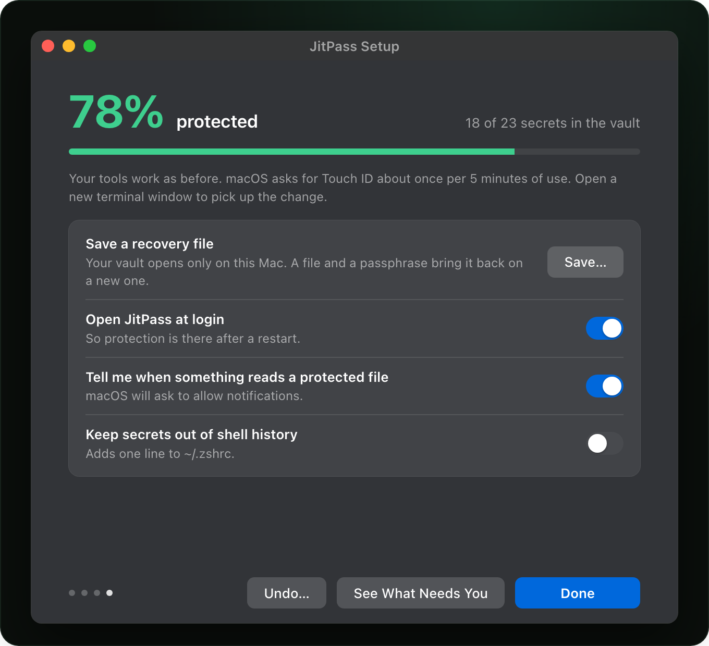
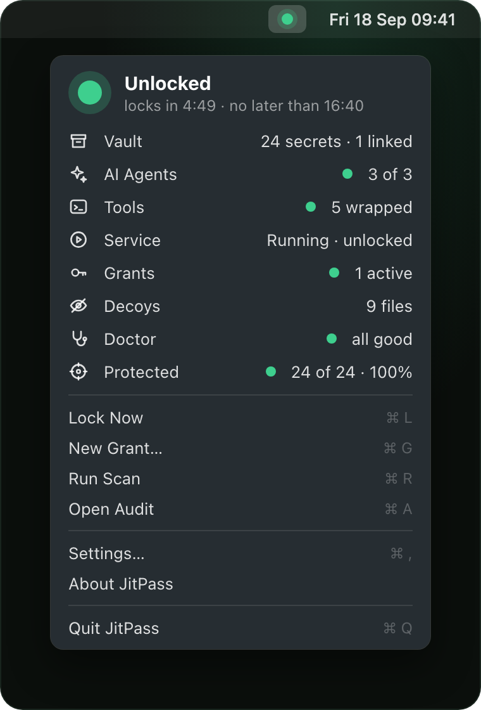
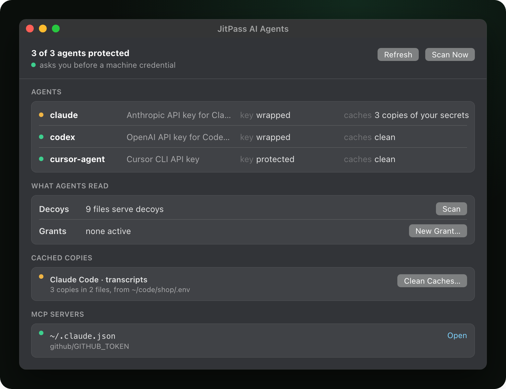
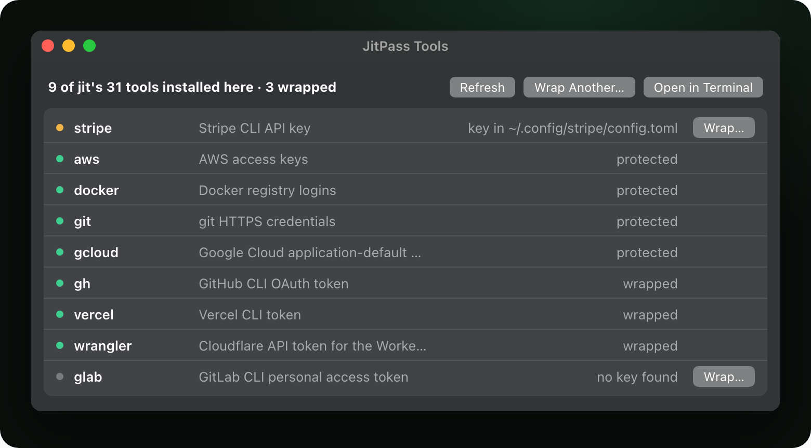
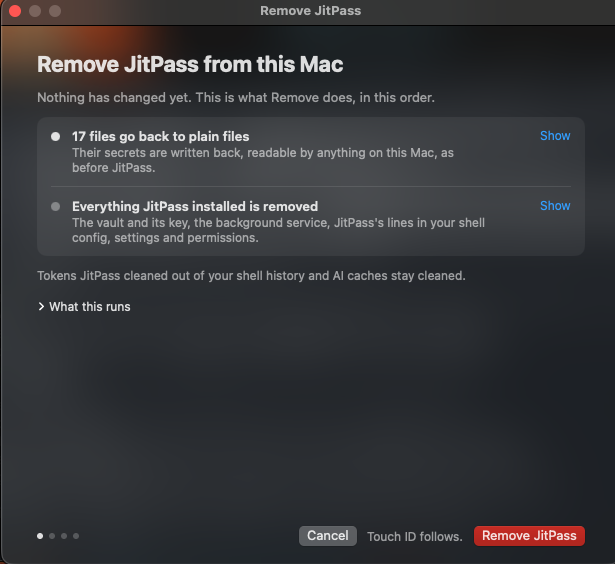

<p align="center">
  <picture>
    <source media="(prefers-color-scheme: dark)" srcset="docs/assets/readme/jitpass-mark-on-dark.svg">
    
  </picture>
</p>

<h1 align="center">JitPass</h1>

<p align="center"><b>Just-In-Time Secret Protection for Developers &amp; AI Agents</b></p>

<p align="center">
  Your AI agent can read every secret on your Mac.<br>
  <b>JitPass makes it ask first.</b>
</p>

<p align="center">
  <a href="https://github.com/jitpass/jit-app/releases/latest"></a>
  
  
  <a href="./LICENSE"></a>
</p>

<p align="center">
  <a href="https://dl.jitpass.com/jitpass/jit-app/releases/latest/download/JitPass-arm64.zip"><b>Download for Mac</b></a> ·
  <a href="#install"><code>brew install jitpass/tap/jitpass</code></a> ·
  <a href="./docs/index.md">Docs</a> ·
  <a href="https://jitpass.com">jitpass.com</a>
</p>

<p align="center"><sub>Free for personal and internal company use · No account · No telemetry · Nothing leaves your Mac · Every change can be undone</sub></p>

<p align="center">
  
  <br>
  <sub><code>claude</code> ran <code>aws s3 ls</code>. Before the AWS key goes anywhere, JitPass says who is asking. You answer with Touch ID, or say no.</sub>
</p>

## Your secrets are in plain files. Anything you run can read them.

API keys in `.env`, cloud credentials in `~/.aws/credentials`, tokens in
`.npmrc`, exports in `~/.zshrc`, your shell history, the MCP configs your
agents read. **Nothing has to be hacked for them to leak.** A compromised npm
package, a trojanized IDE extension or a prompt-injected agent runs as you, so
it can simply open the file.

**JitPass moves each secret into a local vault that opens with Touch ID, and
leaves a decoy where the plaintext was.** Your tools keep working. A program
that asks for a real value is named, and you decide. Anything that just reads
the file gets the decoy, and the read is logged.

## Three steps, about two minutes

1. **Find every exposed secret.** Setup scans your Mac and only reads. You see
   each plaintext secret: the file, what kind of key it is, and a masked value.
2. **Lock them away in one click.** Each secret moves into the vault and a decoy
   takes its place. Every file is backed up, encrypted, before it is touched,
   and your tools read their secrets the same way as before.
3. **Approve every request.** From then on, when a program reaches for a real
   secret, JitPass shows you which program and what launched it, like the sheet
   at the top of this page. Allow it with Touch ID, or deny it.

<table>
  <tr>
    <td width="50%" align="center"><a href="docs/assets/readme/step-results.png"></a></td>
    <td width="50%" align="center"><a href="docs/assets/readme/step-finish.png"></a></td>
  </tr>
  <tr>
    <td align="center"><b>1.</b> What the scan found, before anything changes</td>
    <td align="center"><b>2.</b> Protected, with every change backed up</td>
  </tr>
</table>

No terminal needed: open JitPass and setup walks you through steps 1 and 2.

<details>
<summary><b>Prefer the terminal?</b> The same three steps as commands</summary>

```sh
jit scan                 # read-only: every exposed secret, file and line
jit migrate --dry-run    # preview the whole fix plan
jit migrate              # apply it: shows the plan, asks [y/N], one Touch ID
jit audit                # afterwards: every request, and what you answered
```

`jit scan` with no path sweeps your home folder; point it somewhere to go
faster (`jit scan ~/.aws`). Everything the app does is one of these commands.

</details>

## What you get

<table>
  <tr>
    <td width="50%" valign="top"><a href="#how-it-works-mechanically"><b>Decoys on disk</b></a><br>A program that reads <code>.env</code> or <code>~/.aws/credentials</code> without asking gets placeholder values, and the read is logged.</td>
    <td width="50%" valign="top"><a href="#two-touch-id-moments"><b>Every request named</b></a><br>The first time a program reaches for a real secret, you see which one and what launched it, then decide.</td>
  </tr>
  <tr>
    <td width="50%" valign="top"><a href="#built-for-ai-agents"><b>Built for AI agents</b></a><br>MCP configs hold vault paths instead of keys. Agents get secrets only when you say so, even overnight.</td>
    <td width="50%" valign="top"><a href="#your-tools-keep-working"><b>Your tools keep working</b></a><br><code>aws</code>, <code>gh</code>, <code>docker</code>, <code>terraform</code>, <code>kubectl</code> and your shell resolve secrets the way they always did.</td>
  </tr>
  <tr>
    <td width="50%" valign="top"><a href="#see-what-happened-and-who-did-it"><b>A full audit trail</b></a><br>Every use, unlock and refusal, with the program that asked and the one that launched it.</td>
    <td width="50%" valign="top"><a href="#undo-anything-or-remove-it-all"><b>Undo anything</b></a><br>Every file is backed up before it changes. Put one back, or remove JitPass and get every file back.</td>
  </tr>
</table>

## It lives in your menu bar



After setup, JitPass is a ring in your menu bar: **green** unlocked, **red**
locked, **amber** a program is asking.

Click it to see your vault, your agents and tools, active grants, today's decoy
reads, and how much of your Mac is protected. Lock, New Grant, Run Scan and
Open Audit are one click away, and every window runs the same commands as the
`jit` CLI.

<br clear="right">

## Install

```sh
brew install jitpass/tap/jitpass
```

That installs JitPass into /Applications with the `jit` command line inside
it, linked onto PATH with shell completions. **Without Homebrew,**
[download the app](https://dl.jitpass.com/jitpass/jit-app/releases/latest/download/JitPass-arm64.zip),
drag it into Applications and open it: it offers to link `jit` onto your PATH
and checks for a newer release once a day.

Either way you get the same build, signed with a Developer ID and notarized by
Apple, and Gatekeeper checks it before it first runs. Check it yourself:
`jit doctor` reports `signed CZC6BH93GJ`. To update, `brew upgrade jitpass`,
or the app tells you when a release is out. Installs and updates never touch
your vault.

<details>
<summary>Only the command line, for a Mac with no app (the weaker path, and why)</summary>

```sh
curl -sL https://dl.jitpass.com/jitpass/jit/releases/latest/download/jitpass_darwin_arm64.tar.gz | tar -xz jit
shasum -a 256 jit   # compare against checksums.txt on the release page
codesign -dv --verify --verbose=2 ./jit   # expect: Developer ID, TeamIdentifier=CZC6BH93GJ
sudo mv jit /usr/local/bin/
echo 'source <(jit completion zsh)' >> ~/.zshrc && exec zsh
```

`curl` sets no quarantine bit, so Gatekeeper never consults the notarization
ticket; the same is true of `go install`. The binary is still signed and
notarized, so the lines above let you check both, but you have to run them.
Update it with `jit upgrade`, a verified self-update. Pick one route: if you
switch to Homebrew later, remove this copy (`sudo rm /usr/local/bin/jit`),
and `jit doctor` flags two jits on PATH if you forget.

On an Intel Mac, build from source with
`go install github.com/jitpass/jit/cmd/jit@latest`.

</details>

## Built for AI agents

Your coding agent runs as you, with your shell and your files. One poisoned
README, issue or web page can tell it to `cat .env` and paste the result
somewhere. With JitPass, there is nothing real in that file to paste.

<p align="center">
  
</p>

- **A cold read gets a decoy.** Placeholders, and the read is logged:
  ```console
  $ cat .env
  STRIPE_API_KEY=jit-hidden-STRIPE_API_KEY
  DATABASE_URL=jit-hidden-DATABASE_URL
  ```
- **Using a secret means asking.** When the agent runs `aws`, `gh` or an MCP
  server that needs a real key, JitPass names the program and the agent that
  launched it, and you decide.
- **MCP configs hold vault paths, not keys.** After `jit migrate ~/.claude.json`,
  each server launches through `jit run`, so the config is safe to have on disk
  and safe to hand to the agent.
- **The agents' own API keys too.** `jit wrap claude`, and codex, gemini,
  cursor-agent, copilot, cline, opencode and kiro-cli.
- **Secrets your agent already saw.** Transcripts and edit history keep copies
  of keys that passed through the agent. The scan finds those copies, so you
  know which keys to rotate.
- **Let it work overnight, then check.** A [grant](#leaving-the-keyboard) covers
  one agent for a set time; the [audit](#see-what-happened-and-who-did-it) shows
  what it touched.

```sh
jit migrate ~/.claude.json            # MCP server keys move to the vault
jit wrap claude                       # the agent's own API key too
jit grant --process claude --profile myapp --for 8h   # let it work overnight
jit audit --parent claude             # read back what it touched
```

More in [MCP and AI tools](./docs/migrate/mcp.md) and
[per-process consent](./docs/service/consent.md).

## Your tools keep working

No new commands to learn. Protect a credential once, then keep typing what you always typed.

<p align="center">
  
</p>

The **Tools** window shows every CLI jit knows on your Mac: which are protected,
which are wrapped, and which still keep a key in the open, one click from
**Wrap…**.

```sh
aws s3 ls                     # AWS and Terraform: from the vault, no prefix, no flag
gh pr list                    # CLIs with their own token (gh, stripe, glab): wrapped once
docker login ghcr.io          # registry logins are stored through a credential helper
jit run -- docker compose up  # tools that only read a file get it for one run
./deploy.sh                   # exports that lived in ~/.zshrc: new shells just have them
```

The rule behind it: if a tool can ask for a secret itself (AWS
`credential_process`, docker and git credential helpers, kubectl exec plugins,
your shell at login), you type nothing extra. If it only reads a file, `jit run`
hands it the value, or the file becomes a live mount that serves real values
only inside a run you approved.

**Supported:** `.env` files, shell exports, AWS and Terraform, kubeconfig,
Docker registries, GCP ADC, `.npmrc` and `.netrc`, MCP configs, bare token
files, tokens in your shell history, wrappable CLIs (`gh`, `stripe`, `vercel`
and more) and SSO CLIs that mint credentials at login. The full list, with
exactly what to type for each, is **[Supported tools](./docs/tools.md)**;
anything else can be wrapped with [`jit wrap add`](./docs/wrap/custom-tools.md).

**Already use 1Password?** Keep it as your source of truth.
[`jit migrate` links instead of copying](./docs/vault/1password.md): a value
that lives in 1Password is vaulted as its `op://` reference, and JitPass
decides which process gets it.

## Two Touch ID moments

1. **Unlocking the vault.** One fingerprint opens it for the session: 5
   minutes of activity, then it locks again, and never longer than 8 hours.
   You unlock once, not once per command.
2. **Handing a secret to a program.** The first time a given program reaches
   for a real secret, JitPass names it and asks: the sheet at the top of this
   page, or a Touch ID prompt when the app is not running. That program is not
   asked again this session; a different one is.

The second question is what keeps an unlocked vault from being a free-for-all.
You used `aws` a minute ago, the vault is open, and a sketchy `npm install`
reaches for the same keys: it still has to ask, by name. Only want the vault
lock? Turn the second question off in Settings, or with
`jit service consent off`. Starting something that needs several secrets at
once? `jit run --trust -- terraform apply` approves that whole run in one
gesture. Details: [per-process consent](./docs/service/consent.md).

## Leaving the keyboard

An agent working overnight, a long build or a 3 a.m. job stalls on a question
nobody is there to answer. A **grant** moves your decision earlier instead of removing
it: one Touch ID while you are still there, naming exactly what you allow and
for how long.

```console
$ jit grant --process claude --profile myapp --for 8h
  Touch ID  ->  let claude under iTerm2 use 2 secrets (myapp) unattended for 8h
✓ granted g-7f3a2c81   claude -> myapp   until 17:42
```

It covers `claude` under the terminal you typed that in, through screen lock,
and nothing called `claude` anywhere else. It ends at its deadline, when you
quit that terminal, or on `jit grant revoke`, which needs no fingerprint:
taking access away is always free. **New Grant…** in the menu bar does the
same. Details: [process grants](./docs/service/grants.md).

## See what happened, and who did it

Every use, unlock and refusal lands in a durable log, and so does every time a
program read a decoy. Arguments are masked, so the log proves a command ran
without storing the secret it carried.

```console
$ jit audit --since 1h --format logfmt
time=2026-07-24 10:16:22 level=info kind=use op="read a secret" cmd="aws s3 ls" parent=claude secrets=aws/default
time=2026-07-24 10:31:09 level=warn kind=unlock status=denied method=touchid-or-passcode cmd="node postinstall.js" parent=npm secrets=aws/default
```

The first line is the story JitPass exists to tell: `aws/default` read by
`aws s3 ls`, launched by `claude`. The second is a request you refused: a
`node postinstall.js` under `npm` reaching for the same keys. Plain `jit audit`
shows the same events as a grouped timeline, and so does **Audit** in the menu
bar. Filter with `--parent claude`, `--secret aws`, `--status denied` or
`--since 3d`, and stream with `--follow`.

## Undo anything, or remove it all

JitPass never destroys a credential. It **moves** the value into the vault and
leaves a **working hook** where it was (a decoy `.env`, an
`eval "$(jit export)"` line in your shell config, `credential_process = jit …`
in `~/.aws/config`, or a `PATH` shim). Before it touches a file, it backs the
file up, encrypted, into the vault.

```sh
jit migrate ~/code/myapp        # applied, one Touch ID
jit migrate undo ~/code/myapp   # every touched file restored, byte for byte
```

**Changed your mind about all of it?** Settings › **Remove JitPass…** shows
you the plan before anything changes, then runs it with one Touch ID:



1. **Your files go back to plain files.** Every secret is written back where
   it came from, readable as it was before JitPass.
2. **Everything JitPass installed is removed:** the vault and its key, the
   background service, its lines in your shell config, its settings and
   permissions.

Tokens it cleaned out of your shell history and AI caches stay cleaned. If a
file cannot be put back, it stops and asks before deleting anything. Moving
the app to the Trash is your last click. From the terminal:
`jit uninstall --restore --dry-run` shows the same plan.

<br clear="right">

## How it works, mechanically

**The short version:** your secrets live encrypted in a local vault. A small
background service holds the unlocked key for the session and hands a real
value only to a program you approved; everything else reads a decoy.

**Where secrets live.** Each secret is sealed with its own AES-256-GCM key, and
those keys are wrapped by a master key kept in your login keychain, on this Mac
only. Nothing is stored in plaintext, and nothing syncs anywhere.

**How a program gets one.** No kernel extension, no filesystem driver, no FUSE.
Three mechanisms, picked by what the tool can do:

1. **Environment variables into one process, then `execve`.** jit's own image
   is replaced by your command, so the value lives in that one process and jit
   is gone from memory.
2. **The tool's native credential protocol**, where one exists: AWS
   `credential_process`, docker and git credential helpers, kubectl exec
   plugins, Terraform's credentials helper. The tool asks, jit answers, no
   file involved.
3. **A named-pipe mount**, for tools that can only read a file.

The mount is a POSIX FIFO, created with `mkfifo(2)` at mode `0600`. A program
calling `open(".env")` blocks in the kernel until a writer connects. The
background service is that writer: it opens the path `O_WRONLY`, which
releases the reader, writes the decrypted bytes from memory into the kernel
pipe buffer, closes, and loops back to `open(2)` for the next reader. Nothing
touches the disk. What gets written is decided per read: decoys for an ambient
reader, real values only inside a run you authorized.

**Caller identity explains and audits, it never decides.** Process names are
forgeable, and a fast-closing FIFO reader can evade identification entirely.
The human answering the prompt is the gate; the process name only tells you
what to answer. The app is a thin client of the same service: every action is
a request the `jit` CLI can also send, and the app never sees a secret value or
a key. Full detail in **[how it works](./docs/getting-started/how-it-works.md)**
and **[live mounts](./docs/run/mounts.md)**.

## What it does not do

- It does not make an already-compromised account safe.
- It does not protect a secret once it is in the memory of the program you gave
  it to.
- It is not a team secrets manager or a cloud vault: nothing syncs, and each Mac
  has its own vault.
- It runs on macOS 14+ on Apple Silicon only.

Every boundary is stated on one page:
**[the deliberate limits](./docs/security/brief.md#deliberate-limits-stated-plainly)**.

## Learn more

- **[Quickstart](./docs/getting-started/quickstart.md)**: setup, migrating, living with the fix
- **[How it works](./docs/getting-started/how-it-works.md)**: the vault, the service, mounts and shims on one page
- **[FAQ](./docs/faq.md)**: developer and security questions, answered bluntly
- **[Supported tools](./docs/tools.md)**: what to type for every tool
- **[Command reference](./docs/reference/commands/jit.md)**: every command and flag, generated from the CLI
- **[Security architecture](./docs/security/architecture.md)**: the threat model and the honest limits
- **[The app](https://github.com/jitpass/jit-app)**: the menu bar app's source
- **[CONTRIBUTING.md](./CONTRIBUTING.md)**: build and test setup; sign-off via DCO (`git commit -s`), which also accepts the [CLA](./CLA.md)

## License

[PolyForm Perimeter License 1.0.0](./LICENSE): free for personal and internal
company use.
