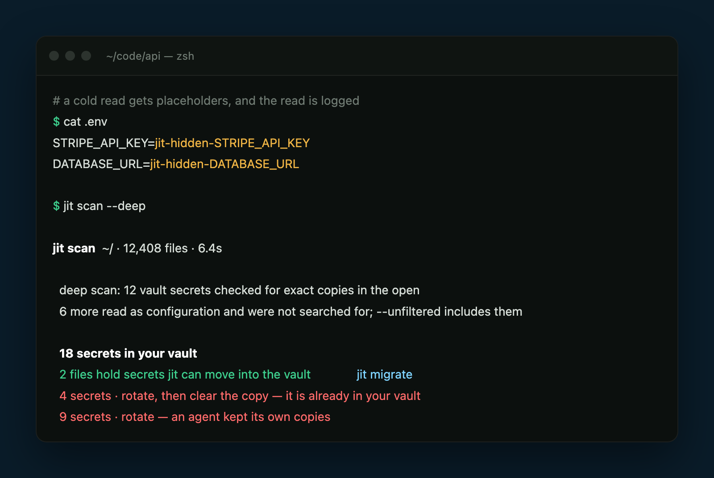
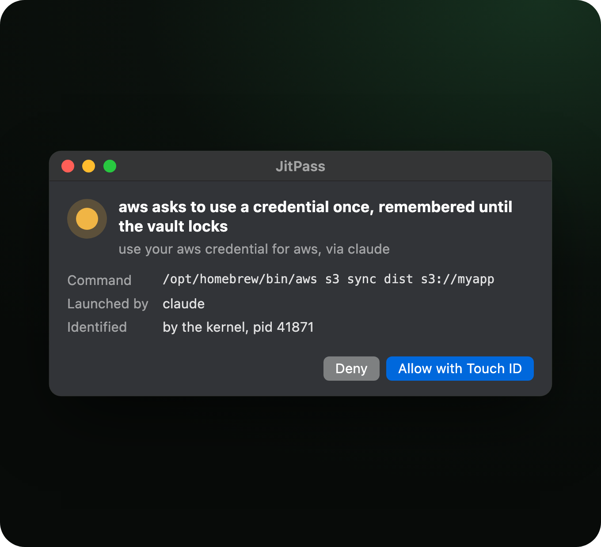
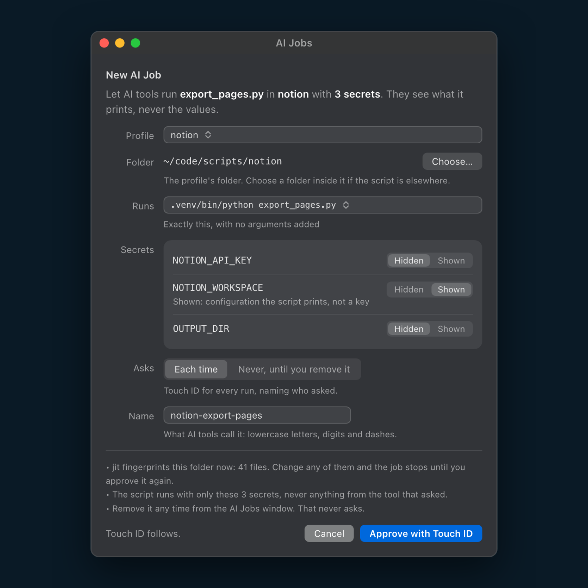
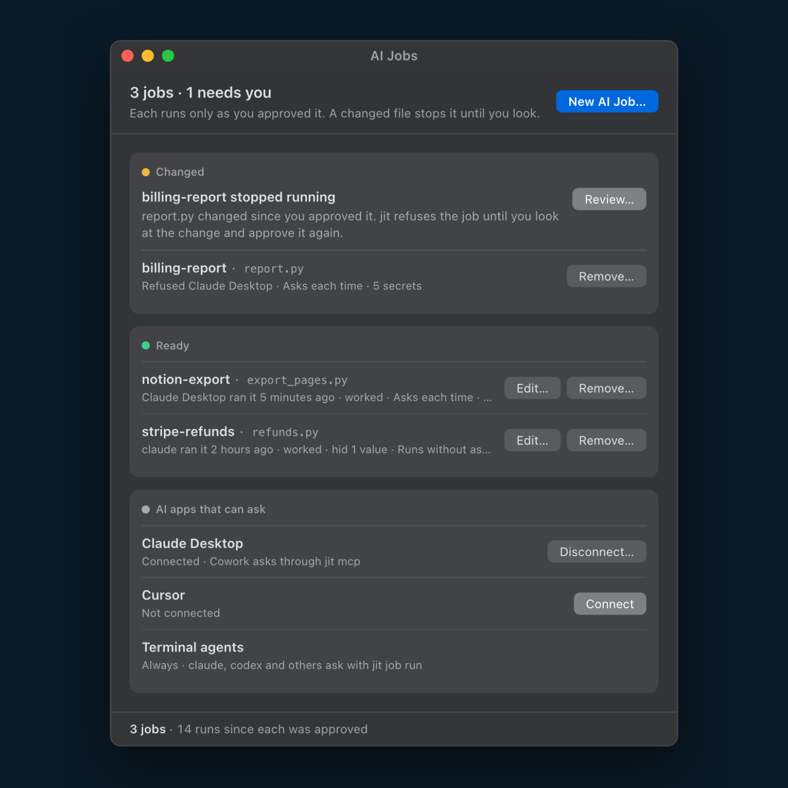
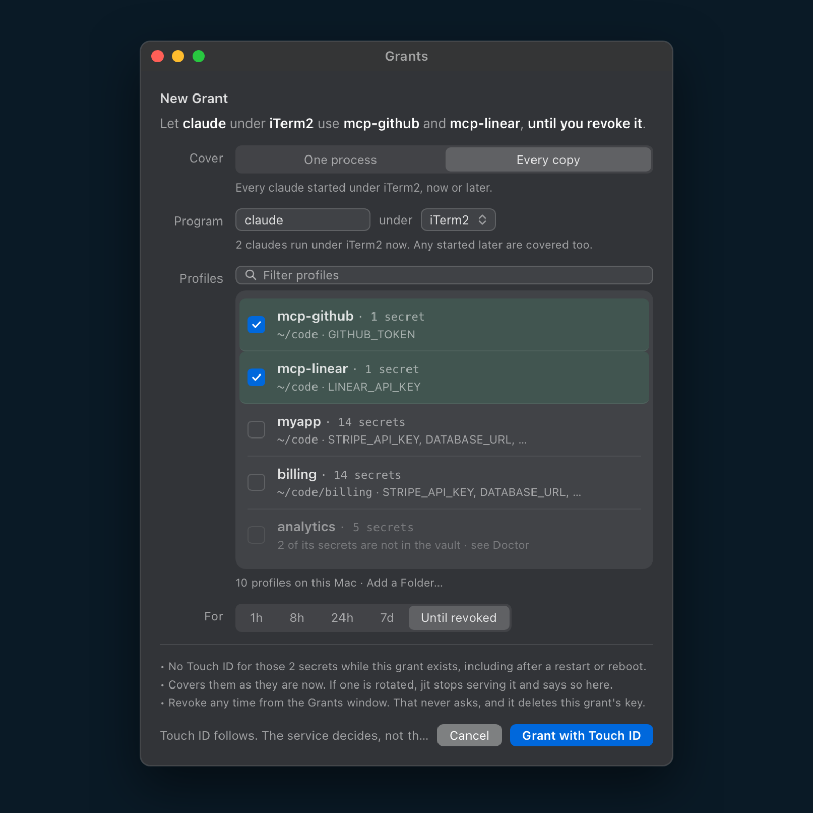
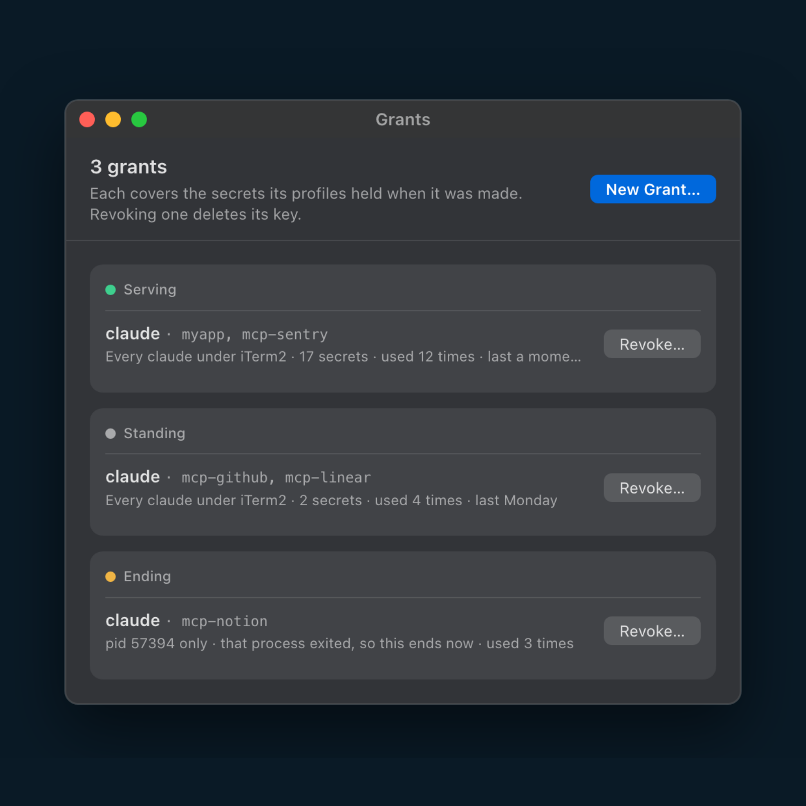
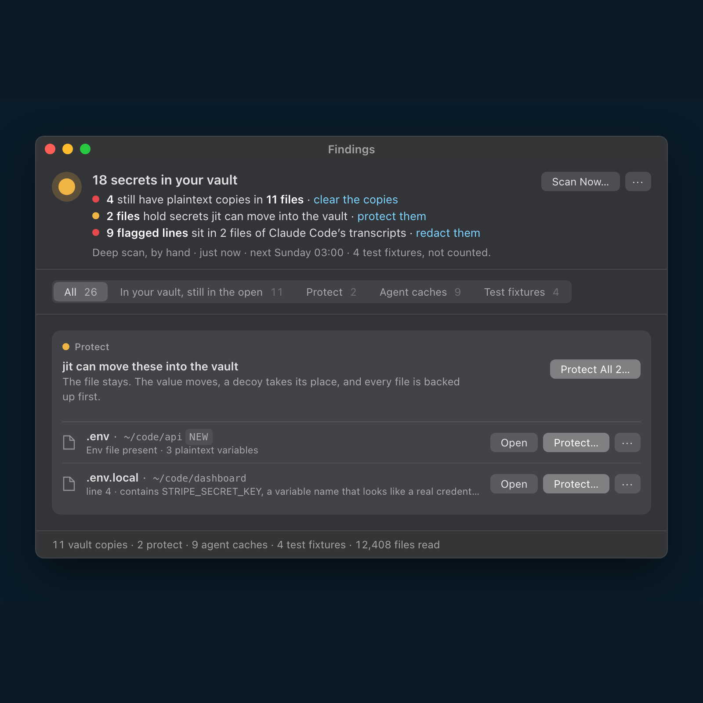
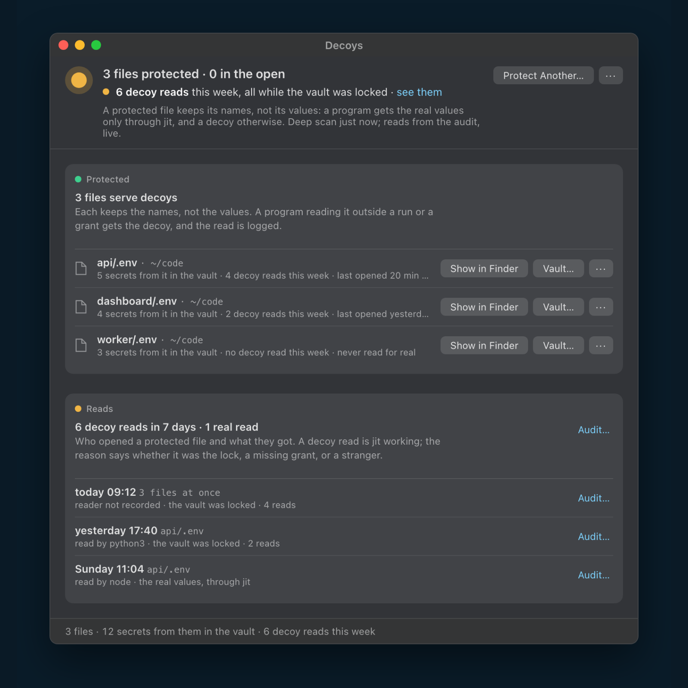
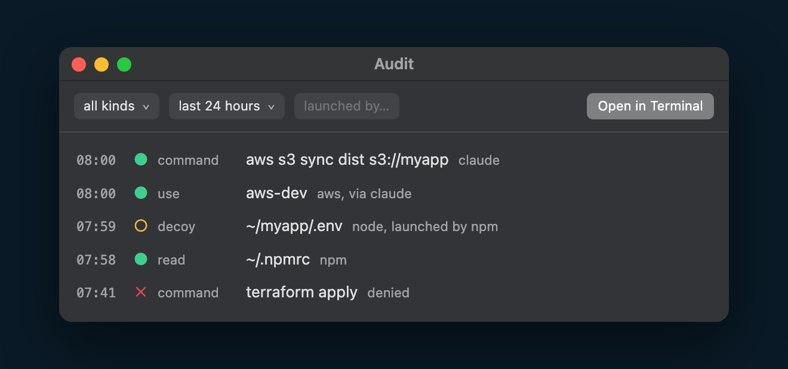

<p align="center">
  <picture>
    <source media="(prefers-color-scheme: dark)" srcset="docs/assets/readme/jitpass-mark-on-dark.svg">
    
  </picture>
</p>

<h1 align="center">JitPass</h1>

<p align="center">
  <b>You have API keys and tokens in plaintext on your Mac.<br>
  Use JitPass to protect them.</b>
</p>

<p align="center">
  <a href="https://github.com/jitpass/jit-app/releases/latest"></a>
  
  
  <a href="./LICENSE"></a>
</p>

<p align="center">
  <a href="https://dl.jitpass.com/jitpass/jit-app/releases/latest/download/JitPass-arm64.zip"><b>Download for Mac</b></a> ·
  <a href="#install"><code>brew install jitpass/tap/jitpass</code></a> ·
  <a href="./docs/index.md">Docs</a> ·
  <a href="https://jitpass.com">jitpass.com</a>
</p>

<p align="center"><sub>Free for personal and internal company use · Source-available · No account · No telemetry · Nothing leaves your Mac · Secure Enclave ready · Every change can be undone</sub></p>

<p align="center">
  <a href="docs/assets/readme/hero.png"></a>
  <br>
  <sub><b>What's the number on your Mac?</b> The scan only reads, and changes nothing until you say so.</sub>
</p>

<p align="center">
  <b>Get started</b> &nbsp;
  <a href="#your-secrets-are-in-plain-files-anything-you-run-can-read-them">The problem</a> ·
  <a href="#three-steps-about-two-minutes">Three steps</a> ·
  <a href="#install">Install</a> ·
  <a href="#it-lives-in-your-menu-bar">The menu bar</a>
  <br>
  <b>Protect</b> &nbsp;
  <a href="#a-list-not-a-score">Findings and decoys</a> ·
  <a href="#your-tools-keep-working">Your tools keep working</a> ·
  <a href="#undo-anything-or-remove-it-all">Undo anything</a>
  <br>
  <b>Approve</b> &nbsp;
  <a href="#two-touch-id-moments">Two Touch ID moments</a> ·
  <a href="#leaving-the-keyboard">Grants</a> ·
  <a href="#see-what-happened-and-who-did-it">The audit</a>
  <br>
  <b>AI agents</b> &nbsp;
  <a href="#built-for-ai-agents">Built for AI agents</a> ·
  <a href="#let-ai-run-your-scripts-never-your-keys">AI jobs</a> ·
  <a href="#a-grant-or-an-ai-job">A grant or an AI job?</a>
  <br>
  <b>More</b> &nbsp;
  <a href="#how-it-compares">How it compares</a> ·
  <a href="#how-it-works-mechanically">How it works</a> ·
  <a href="#what-it-does-not-do">What it does not do</a> ·
  <a href="#learn-more">Docs</a>
</p>

## Your secrets are in plain files. Anything you run can read them.

API keys in `.env`, cloud credentials in `~/.aws/credentials`, tokens in
`.npmrc`, exports in `~/.zshrc`, your shell history, the MCP configs your
agents read. **Nothing has to be hacked for them to leak.** A compromised npm
package, a trojanized IDE extension or a prompt-injected agent runs as you, so
it can simply open the file.

**JitPass moves each secret into a local vault that opens with Touch ID, and
leaves a decoy where the plaintext was.**

<p align="center">
  <a href="docs/assets/readme/terminal.png"></a>
</p>

## Three steps, about two minutes

<table>
  <tr>
    <td width="33%" valign="top">
      <a href="docs/assets/readme/step-find.png"></a>
      <h3>1. Find</h3>
      Setup scans your Mac and changes nothing. It recognises <b>100+ token formats</b> (OpenAI, Anthropic, AWS, GitHub, Stripe and more), plus private keys and database URLs.
    </td>
    <td width="33%" valign="top">
      <a href="docs/assets/readme/step-finish.png"></a>
      <h3>2. Protect</h3>
      <b>One click</b> moves each secret into the vault and leaves a decoy in its place. Every file is backed up first, and your tools keep working.
    </td>
    <td width="33%" valign="top">
      <a href="docs/assets/readme/step-approve.png"></a>
      <h3>3. Approve</h3>
      When a program reaches for a real key, JitPass names it and what launched it. <b>Allow with Touch ID</b>, or deny.
    </td>
  </tr>
</table>

No terminal needed: open JitPass and setup walks you through steps 1 and 2.

<details>
<summary><b>Prefer the terminal?</b> The same three steps as commands</summary>

```sh
jit scan                 # read-only: every exposed secret, file and line
jit migrate --dry-run    # preview the whole fix plan
jit migrate              # apply it: shows the plan, asks [y/N], one Touch ID
jit audit                # afterwards: every request, and what you answered
```

`jit scan` with no path sweeps your home folder; point it somewhere to go
faster (`jit scan ~/.aws`). Everything the app does is one of these commands.

</details>

<p align="center">
  <a href="https://dl.jitpass.com/jitpass/jit-app/releases/latest/download/JitPass-arm64.zip"><b>Download for Mac</b></a> ·
  <code>brew install jitpass/tap/jitpass</code><br>
  <sub>Free · No account · Every change can be undone</sub>
</p>

## What you get

<table>
  <tr>
    <th width="33%" align="left">Protect</th>
    <th width="33%" align="left">Approve</th>
    <th width="33%" align="left">AI agents</th>
  </tr>
  <tr>
    <td width="33%" valign="top"><a href="#a-list-not-a-score"><b>Decoys on disk</b></a><br>A program that reads <code>.env</code> or <code>~/.aws/credentials</code> without asking gets placeholder values, and the read is logged.</td>
    <td width="33%" valign="top"><a href="#two-touch-id-moments"><b>Every request named</b></a><br>The first time a program reaches for a real secret, you see which one and what launched it, then decide.</td>
    <td width="33%" valign="top"><a href="#let-ai-run-your-scripts-never-your-keys"><b>AI Jobs</b></a><br>Approve a script once. Your AI tool runs it and sees what it prints, never the key.</td>
  </tr>
  <tr>
    <td width="33%" valign="top"><a href="#a-list-not-a-score"><b>Findings</b></a><br>What is still in the open, from 100+ token formats, each with the one thing to do about it.</td>
    <td width="33%" valign="top"><a href="#leaving-the-keyboard"><b>Grants for when you are away</b></a><br>Let one agent work overnight without prompts, for an hour, a week, or until you revoke it.</td>
    <td width="33%" valign="top"><a href="#let-ai-run-your-scripts-never-your-keys"><b>Claude Desktop and Cursor</b></a><br>Connect them in one click. They run your AI jobs through a local MCP server, even from a sandbox.</td>
  </tr>
  <tr>
    <td width="33%" valign="top"><a href="#your-tools-keep-working"><b>Your tools keep working</b></a><br><code>aws</code>, <code>gh</code>, <code>docker</code>, <code>terraform</code>, <code>kubectl</code> and your shell get their secrets the way they always did.</td>
    <td width="33%" valign="top"><a href="#see-what-happened-and-who-did-it"><b>A full audit trail</b></a><br>Every use, unlock, refusal and decoy read, with the program that asked and the one that launched it.</td>
    <td width="33%" valign="top"><a href="#built-for-ai-agents"><b>Keys out of AI transcripts</b></a><br>Searches the transcripts and edit history agents keep for copies of your keys and 100+ vendor token formats, and redacts them.</td>
  </tr>
  <tr>
    <td width="33%" valign="top"><a href="#your-tools-keep-working"><b>A clean shell history</b></a><br>A zsh hook keeps any command you type with a token in it out of your history file.</td>
    <td width="33%" valign="top"><a href="#undo-anything-or-remove-it-all"><b>Undo anything</b></a><br>Every file is backed up before it changes. Put one project back, or remove JitPass and get every file back.</td>
    <td width="33%" valign="top"><a href="#built-for-ai-agents"><b>MCP keys out of configs</b></a><br>MCP configs hold vault paths instead of keys, and agents' own API keys move to the vault too.</td>
  </tr>
  <tr>
    <td width="33%" valign="top"><a href="#how-it-works-mechanically"><b>A key that never leaves your Mac</b></a><br>Keep the vault key in the Secure Enclave, the chip that holds keys and never lets them out.</td>
    <td width="33%" valign="top"><a href="#two-touch-id-moments"><b>Locks when you walk away</b></a><br>The vault locks after 5 minutes idle, when your screen locks, and when your Mac sleeps.</td>
    <td width="33%" valign="top"><a href="#built-for-ai-agents"><b>Every agent you use</b></a><br>Claude Code, Codex, Gemini, Cursor, Copilot, Cline, OpenCode and Kiro, each named when it asks.</td>
  </tr>
</table>

## Built for AI agents

Your coding agent runs as you, with your shell and your files. One poisoned
README, issue or web page can tell it to `cat .env` and paste the result
somewhere. With JitPass, there is nothing real in that file to paste.

<p align="center">
  <a href="docs/assets/readme/agents.png"></a>
</p>

- **A cold read gets a decoy**, and the read is logged.
- **Every request is named.** When an agent runs `aws` or an MCP server, you
  see which program and which agent, then decide.
- **Keys out of configs.** MCP server keys and the agents' own API keys move
  to the vault.
- **Keys out of transcripts.** The deep scan finds the copies agents kept,
  across 100+ token formats, and **Redact** clears them.

The **AI Agents** window shows each agent on your Mac: keys in its files,
what it can reach, and what it did this week.

<details>
<summary><b>Prefer the terminal?</b> The same, as commands</summary>

```sh
jit migrate ~/.claude.json            # MCP server keys move to the vault
jit wrap claude                       # the agent's own API key too
jit migrate caches                    # clear copies of vaulted keys from agent transcripts
jit migrate redact                    # and tokens in them that were never vaulted
jit audit --parent claude             # what the agent touched
```

More in [MCP and AI tools](./docs/migrate/mcp.md) and
[per-process consent](./docs/service/consent.md).

</details>

## Let AI run your scripts, never your keys

Some work needs a key and a script, and you want an agent to do it: export a
report, sync a list, call an internal API. Handing the agent the key means it
is in the agent's context, its transcript and its sandbox. An **AI Job** hands
it the result instead.

A job is a command you approved, with the secrets it gets. When an AI tool
asks for one, the **jit service** runs it: it decrypts, starts the command in
its folder, hides every secret value in the output, and hands back the text.

<table>
  <tr>
    <td width="50%" valign="top"><a href="docs/assets/readme/ai-job-sheet-sq.png"></a></td>
    <td width="50%" valign="top"><a href="docs/assets/readme/ai-jobs-window-sq.png"></a></td>
  </tr>
  <tr>
    <td align="center"><b>1.</b> Pick a profile, pick a script, approve with Touch ID</td>
    <td align="center"><b>2.</b> Every job, who ran it, and which AI apps can ask</td>
  </tr>
</table>

Open **AI Jobs** from the menu bar and press **New AI Job…**. Pick the profile
whose secrets the script needs, then the script, and approve. **Connect**
adds jit to Claude Desktop or Cursor; terminal agents like Claude Code and
Codex need nothing.

<details>
<summary><b>Prefer the terminal?</b> The same, as commands</summary>

```console
$ jit job allow notion-export -- .venv/bin/python export_pages.py
  Touch ID  ->  let AI run notion/export_pages.py with 3 notion secrets
✓ Approved notion-export · 41 files fingerprinted
```

```sh
jit job run notion-export          # what Claude Code, Codex or Gemini CLI types
jit mcp install                    # Claude Desktop, whose Cowork shell can't run jit itself
jit mcp install --client cursor    # Cursor
```

</details>

What the tool gets back is the script's own output, then what jit adds:

```console
Exported 42 pages to out/notion_20260925.csv
[jit] new file: out/notion_20260925.csv
[jit] hidden values: none
```

If the script had printed its key, the line would read
`[hidden: NOTION_API_KEY]` in its place, and the count would say so.

Three rules make it safe to leave running:

- **Only you approve a job**, with Touch ID. An agent can propose one; it
  arrives as a filled-in sheet you read before anything runs.
- **A changed file stops the job.** jit fingerprints the folder when you
  approve it. Edit the script or a library it loads, and the job is refused
  until you look at what changed and approve it again.
- **Commands that hand values back are refused.** `python -c`, `sh -c`,
  `env`, `cat`: anything that would just print the secrets it is given.

A job asks for Touch ID on every run by default. `--ask never` lets it run
while you are away, until you remove it; removing a job never asks. Add
`--dry-run` to see the whole job without approving anything. Details:
[AI jobs](./docs/service/ai-jobs.md). Wondering whether you need a grant
instead? See [A grant or an AI job?](#a-grant-or-an-ai-job)

## Leaving the keyboard

An agent working overnight or a 3 a.m. job stalls on a question nobody is
there to answer. A **grant** moves your decision earlier instead of removing
it: one Touch ID while you are still there, naming exactly which program may
use which secrets, and for how long.

<table>
  <tr>
    <td width="50%" valign="top"><a href="docs/assets/readme/grant-sheet-sq.png"></a></td>
    <td width="50%" valign="top"><a href="docs/assets/readme/grants-window-sq.png"></a></td>
  </tr>
  <tr>
    <td align="center"><b>1.</b> Say who, which secrets and how long, then Touch ID</td>
    <td align="center"><b>2.</b> Every grant, how often it was used, and Revoke</td>
  </tr>
</table>

Open **New Grant…** from the menu bar. Pick the program (every copy started
under a terminal or editor, or one running process), tick the profiles it may
use, and choose how long: 1 hour to 7 days, or until you revoke it. A grant
ends at its deadline, when that one process exits, or when you press
**Revoke**, which never asks: taking access away is always free.

<details>
<summary><b>Prefer the terminal?</b> The same, as commands</summary>

```console
$ jit grant --process claude --profile myapp --for 8h
  Touch ID  ->  let claude under iTerm2 use 2 secrets (myapp) unattended for 8h
✓ granted g-7f3a2c81   claude -> myapp   until 17:42
```

It covers `claude` under the terminal you typed that in, through screen lock,
and nothing called `claude` anywhere else. Swap `--for 8h` for
`--until-revoked` and it has no deadline: it holds a key of its own, survives
a restart and a reboot, and ends only on `jit grant revoke`. Details:
[process grants](./docs/service/grants.md).

</details>

### A grant or an AI job?

Both let an agent work without asking you each time. The difference is
whether the agent ever holds the key.

| | Grant | AI job |
|---|---|---|
| **The agent gets** | The real secret values | Only the script's output, with every value hidden |
| **It can run** | Anything it likes, with those secrets | One command you approved, in one folder |
| **Who it covers** | One program: every copy under a terminal, or one process | Any AI tool you connected: terminal agents, Claude Desktop, Cursor |
| **If a file changes** | Keeps working | Stops until you look and approve again |
| **Touch ID** | None while it lasts | Every run, or never until you remove it |
| **Ends** | At its deadline, when its process exits, or on Revoke | When you remove it |
| **Use it when** | The agent needs the key itself: `aws`, `terraform`, an MCP server | The agent needs a result, not the key, or runs in a sandbox like Claude Desktop |

## Your tools keep working

No new commands to learn. Protect a credential once, then keep typing what you always typed.

<p align="center">
  <a href="docs/assets/readme/tools.png"></a>
</p>

The **Tools** window shows every CLI jit protects, and the proof that it is
working: when its key was last read, by what, and whether any other program
touched it.

```sh
aws s3 ls                     # AWS and Terraform: from the vault, no prefix, no flag
gh pr list                    # CLIs with their own token (gh, stripe, glab): wrapped once
docker login ghcr.io          # registry logins are stored through a credential helper
jit run -- docker compose up  # tools that only read a file get it for one run
./deploy.sh                   # exports that lived in ~/.zshrc: new shells just have them
```

<details>
<summary><b>Prefer the terminal?</b> The Tools window, as commands</summary>

```sh
jit wrap list                 # every wrapped tool, and whether its shim works
jit wrap add gh --env GH_TOKEN=wrap-gh/GH_TOKEN   # wrap a tool jit doesn't know yet
jit audit --kind use --since 7d   # which program read which key this week
jit guard history             # keep typed tokens out of your zsh history file
```

</details>

**Your shell history stays clean too.** `jit guard history` adds a small zsh
hook: a command you type with a token in it still works, and up-arrow still
finds it, but it is never written to your history file, so it can't end up in
a backup or a dotfiles repo. The hook fails open: if anything goes wrong, the
line is saved as normal and your shell never waits on it.

**Supported:** `.env` files, shell exports, AWS and Terraform, kubeconfig,
Docker registries, GCP ADC, `.npmrc` and `.netrc`, MCP configs, bare token
files, tokens in your shell history, wrappable CLIs (`gh`, `stripe`, `vercel`
and more) and SSO CLIs that mint credentials at login. The full list, with
exactly what to type for each, is **[Supported tools](./docs/tools.md)**;
anything else can be wrapped with [`jit wrap add`](./docs/wrap/custom-tools.md).

## How it compares

Other tools keep secrets out of your repo. **JitPass is the only one that
decides which program on your Mac gets each secret**, and it is built for
the AI agents that run on it.

| | **JitPass** | 1Password | Varlock | Doppler | dotenvx |
|---|:---:|:---:|:---:|:---:|:---:|
| Asks per program, even while unlocked | ✅ | ❌ | ❌ | ❌ | ❌ |
| Finds plaintext keys already on your Mac | ✅ | 🟡 | 🟡 | ❌ | ❌ |
| Finds your keys in AI agent transcripts, and redacts them | ✅ | ❌ | ❌ | ❌ | ❌ |
| A cold read of `.env` gets a decoy, and is logged | ✅ | ❌ | 🟡 | 🟡 | 🟡 |
| AI can use a secret without ever seeing it | ✅ | 🟡 | ✅ | ❌ | ❌ |
| Local only, no account, no cloud | ✅ | ❌ | ✅ | ❌ | ✅ |

<sub>✅ yes · 🟡 partly, see below · ❌ no. From each tool's own documentation, September 2026.</sub>

<details>
<summary>What each mark means</summary>

- **Asks per program.** JitPass names the program and what launched it, and
  asks again for a different one. 1Password's local `.env` is readable by
  "every process" while it is unlocked. Varlock, Doppler and dotenvx give the
  values to whatever you start through their command.
- **Finds plaintext keys.** JitPass sweeps your home folder, shell history
  and MCP configs. 1Password's Developer Watchtower finds `.env` files.
  `varlock scan` searches your codebase. dotenvx blocks committing a plaintext
  `.env`, which stops a leak but does not find one.
- **A cold read.** JitPass leaves a decoy and logs the read. Varlock's
  schema holds no values, Doppler keeps no file, and dotenvx's file is
  ciphertext; none of them logs who read it.
- **AI without the key.** JitPass runs an AI job and hands back the output.
  Varlock's credential proxy gives an agent placeholders and adds the real
  values at the network boundary. 1Password's Secure Agentic Autofill signs a
  browser agent in to websites without showing it the password; it does not
  cover API keys or scripts.
- **Local only.** 1Password syncs through your account, and Doppler is a
  cloud service. Varlock can encrypt locally, and dotenvx keeps an encrypted
  file in your repo.

Teams that share secrets across machines need one of the others; JitPass
protects the Mac you work on, and works with them.

</details>

**Already use 1Password?** Keep it as your source of truth.
[`jit migrate` links instead of copying](./docs/vault/1password.md): a value
that lives in 1Password is vaulted as its `op://` reference, and JitPass
decides which program gets it.

## Undo anything, or remove it all

JitPass never destroys a credential. It moves the value into the vault, leaves
a working hook where it was, and backs the file up, encrypted, before it
touches it.

**Changed your mind about all of it?** Settings › **Remove JitPass…** shows
you the plan before anything changes, then runs it with one Touch ID:

<a href="docs/assets/readme/remove.png"></a>

1. **Your files go back to plain files.** Every secret is written back where
   it came from, readable as it was before JitPass.
2. **Everything JitPass installed is removed:** the vault and its key, the
   background service, its lines in your shell config, its settings and
   permissions.

Tokens it cleaned out of your shell history and AI caches stay cleaned. If a
file cannot be put back, it stops and asks before deleting anything. Moving
the app to the Trash is your last click.

<br clear="right">

<details>
<summary><b>Prefer the terminal?</b> The same, as commands</summary>

```sh
jit migrate undo ~/code/myapp      # one project back, every file byte for byte
jit uninstall --restore --dry-run  # the whole removal plan, changing nothing
jit uninstall --restore            # run it
```

</details>

## Install

```sh
brew install jitpass/tap/jitpass
```

That installs JitPass into /Applications with the `jit` command line inside
it, linked onto PATH with shell completions. **Without Homebrew,**
[download the app](https://dl.jitpass.com/jitpass/jit-app/releases/latest/download/JitPass-arm64.zip),
drag it into Applications and open it: it offers to link `jit` onto your PATH
and checks for a newer release once a day.

Either way you get the same build, signed with a Developer ID and notarized by
Apple, and Gatekeeper checks it before it first runs. Check it yourself:
`jit doctor` reports `signed CZC6BH93GJ`. To update, `brew upgrade jitpass`,
or the app tells you when a release is out. Installs and updates never touch
your vault.

JitPass needs macOS 14 or later on Apple Silicon. On an Intel Mac, build the
CLI from source: `go install github.com/jitpass/jit/cmd/jit@latest`.

<details>
<summary>Only the command line, for a Mac with no app (the weaker path, and why)</summary>

```sh
curl -sL https://dl.jitpass.com/jitpass/jit/releases/latest/download/jitpass_darwin_arm64.tar.gz | tar -xz jit
shasum -a 256 jit   # compare against checksums.txt on the release page
codesign -dv --verify --verbose=2 ./jit   # expect: Developer ID, TeamIdentifier=CZC6BH93GJ
sudo mv jit /usr/local/bin/
echo 'source <(jit completion zsh)' >> ~/.zshrc && exec zsh
```

`curl` sets no quarantine bit, so Gatekeeper never consults the notarization
ticket; the same is true of `go install`. The binary is still signed and
notarized, so the lines above let you check both, but you have to run them.
Update it with `jit upgrade`, a verified self-update. Pick one route: if you
switch to Homebrew later, remove this copy (`sudo rm /usr/local/bin/jit`),
and `jit doctor` flags two jits on PATH if you forget.

</details>

## It lives in your menu bar

<a href="docs/assets/readme/panel.png"></a>

After setup, JitPass is a ring in your menu bar: **green** unlocked, **red**
locked, **amber** a program is asking.

Click it to see your vault, your agents and tools, active grants, AI jobs,
today's decoy reads, and what is left to do. **Lock Now**, **New Grant…**,
**New Scan…** and **Open Audit** are one click away, and every window runs
the same commands as the `jit` CLI.

Scans run on a schedule too. A scheduled scan that finds something new tells
you once, and the result waits in **Findings**.

<br clear="right">

<details>
<summary><b>Prefer the terminal?</b> The panel, as commands</summary>

```sh
jit status                    # the vault, the service, grants and what is protected
jit lock                      # Lock Now
jit doctor                    # the Doctor row: what is broken, and the fix
jit scan                      # New Scan
jit audit                     # Open Audit
```

</details>

## A list, not a score

Most security tools hand you a number. JitPass hands you what to do, and
every number opens the thing it counts.

<table>
  <tr>
    <td width="50%" valign="top"><a href="docs/assets/readme/findings-sq.png"></a></td>
    <td width="50%" valign="top"><a href="docs/assets/readme/decoys-sq.png"></a></td>
  </tr>
  <tr>
    <td align="center"><b>Findings:</b> what is still in the open, and the one fix for each</td>
    <td align="center"><b>Decoys:</b> who opened a protected file, and what they got</td>
  </tr>
</table>

<details>
<summary><b>Prefer the terminal?</b> The same, as commands</summary>

```sh
jit scan --deep               # Findings: what is in the open, including copies of vaulted keys
jit migrate                   # protect them
jit migrate caches            # clear the copies agents kept
jit migrate redact            # redact other tokens in agent transcripts
jit audit --status decoy      # Decoys: every read that got a decoy
```

</details>

## Two Touch ID moments

**Unlocking the vault** once opens it for your session. **Handing a secret to
a program** asks again, by name, the first time each program reaches for one.
The second question is what keeps an unlocked vault from being a free-for-all:
you used `aws` a minute ago, and a sketchy `npm install` reaching for the same
keys still has to ask.

<details>
<summary><b>Details:</b> how long a session lasts, and turning the second question off</summary>

A session ends after 5 minutes without use, and never lasts longer than
8 hours. When the app is not running, the second question is a Touch ID
prompt that names the program.

Only want the vault lock? Turn the second question off in Settings, or with
`jit service consent off`. Starting something that needs several secrets at
once? `jit run --trust -- terraform apply` approves that whole run in one
gesture. Details: [per-process consent](./docs/service/consent.md).

</details>

## See what happened, and who did it

Every use, unlock and refusal lands in a durable log, and so does every time a
program read a decoy. Arguments are masked, so the log proves a command ran
without storing the secret it carried.

<p align="center">
  <a href="docs/assets/readme/audit.png"></a>
</p>

Read it from the bottom up. At 07:41 you said no to `terraform apply`. At
07:59 an `npm install` script opened `~/myapp/.env` and got the decoy. At
08:00 you asked Claude to upload the build, and `aws` used your key, with
`claude` named as the program that launched it. **Open Audit** in the menu
bar shows it; filter by kind, time, or what launched it.

<details>
<summary><b>Prefer the terminal?</b> The same log, and its filters</summary>

```console
$ jit audit --since 1h --format logfmt
time=2026-07-24 10:16:22 level=info kind=use op="read a secret" cmd="aws s3 ls" parent=claude secrets=aws/default
time=2026-07-24 10:31:09 level=warn kind=unlock status=denied method=touchid-or-passcode cmd="node postinstall.js" parent=npm secrets=aws/default
```

Plain `jit audit` shows the same events as a grouped timeline. Filter with
`--parent claude`, `--secret aws`, `--status denied` or `--since 3d`, and
stream with `--follow`.

</details>

## How it works, mechanically

**Where secrets live.** Each secret is sealed with its own AES-256-GCM key, and
those keys are wrapped by a master key kept in your login keychain, on this Mac
only. Nothing is stored in plaintext, and nothing syncs anywhere.

**Or in the Secure Enclave.** Move the master key into your Mac's Secure
Enclave, the chip that holds keys and never lets them out. Then the key cannot
be copied off this Mac, and no other program running as you can read it.
Opening it takes Touch ID or your password, enforced by the Secure Enclave. It is opt-in and off by default: in JitPass, open Settings › Protection and
choose **Move to Secure Enclave…** on the Vault key row. It saves a recovery
file first, and **Move Back to Keychain…** is in the same row's ··· menu. Your
secrets, grants and AI jobs stay as they are, and nothing is re-encrypted.

<details>
<summary><b>Prefer the terminal?</b> Moving the key, and its limits</summary>

```sh
jit vault export                            # a current recovery file is required first
jit vault rekey --wrapper secure-enclave    # move the vault key into the Secure Enclave
jit vault rekey --wrapper keychain          # move it back, any time
```

It needs an Apple Silicon Mac and the `jit` inside JitPass.app; a `jit`
installed on its own cannot reach the Secure Enclave, and says so. The key
cannot follow you to a new Mac, so jit refuses the move until you have a
current recovery file.

</details>

**How a program gets one.** No kernel extension, no filesystem driver, no FUSE.
Three mechanisms, picked by what the tool can do:

1. **Environment variables into one process, then `execve`.** jit's own image
   is replaced by your command, so the value lives in that one process and jit
   is gone from memory.
2. **The tool's native credential protocol**, where one exists: AWS
   `credential_process`, docker and git credential helpers, kubectl exec
   plugins, Terraform's credentials helper. The tool asks, jit answers, no
   file involved.
3. **A named-pipe mount**, for tools that can only read a file.

<details>
<summary>The named-pipe mount, and why caller identity never decides</summary>

The mount is a POSIX FIFO, created with `mkfifo(2)` at mode `0600`. A program
calling `open(".env")` blocks in the kernel until a writer connects. The
background service is that writer: it opens the path `O_WRONLY`, which
releases the reader, writes the decrypted bytes from memory into the kernel
pipe buffer, closes, and loops back to `open(2)` for the next reader. Nothing
touches the disk. What gets written is decided per read: decoys for an ambient
reader, real values only inside a run you authorized.

**Caller identity explains and audits, it never decides.** Process names are
forgeable, and a fast-closing FIFO reader can evade identification entirely.
The human answering the prompt is the gate; the process name only tells you
what to answer. The app is a thin client of the same service: every action is
a request the `jit` CLI can also send, and the app never sees a secret value or
a key.

</details>

Full detail in **[how it works](./docs/getting-started/how-it-works.md)**
and **[live mounts](./docs/run/mounts.md)**.

## What it does not do

- It does not make an already-compromised account safe.
- It does not protect a secret once it is in the memory of the program you gave
  it to.
- An AI job's output is only as safe as its script. jit hides the values it
  injected; it cannot hide something the script computed from them.
- It is not a team secrets manager or a cloud vault: nothing syncs, and each Mac
  has its own vault.
- It runs on macOS 14+ on Apple Silicon only.

Every boundary is stated on one page:
**[the deliberate limits](./docs/security/brief.md#deliberate-limits-stated-plainly)**.

## Learn more

- **[Quickstart](./docs/getting-started/quickstart.md)**: setup, migrating, living with the fix
- **[How it works](./docs/getting-started/how-it-works.md)**: the vault, the service, mounts and shims on one page
- **[FAQ](./docs/faq.md)**: developer and security questions, answered bluntly
- **[Supported tools](./docs/tools.md)**: what to type for every tool
- **[Command reference](./docs/reference/commands/jit.md)**: every command and flag, generated from the CLI
- **[Security architecture](./docs/security/architecture.md)**: the threat model and the honest limits
- **[The app](https://github.com/jitpass/jit-app)**: the menu bar app's source
- **[CONTRIBUTING.md](./CONTRIBUTING.md)**: build and test setup; sign-off via DCO (`git commit -s`), which also accepts the [CLA](./CLA.md)

## License

[PolyForm Perimeter License 1.0.0](./LICENSE): source-available, and free for
personal and internal company use.
